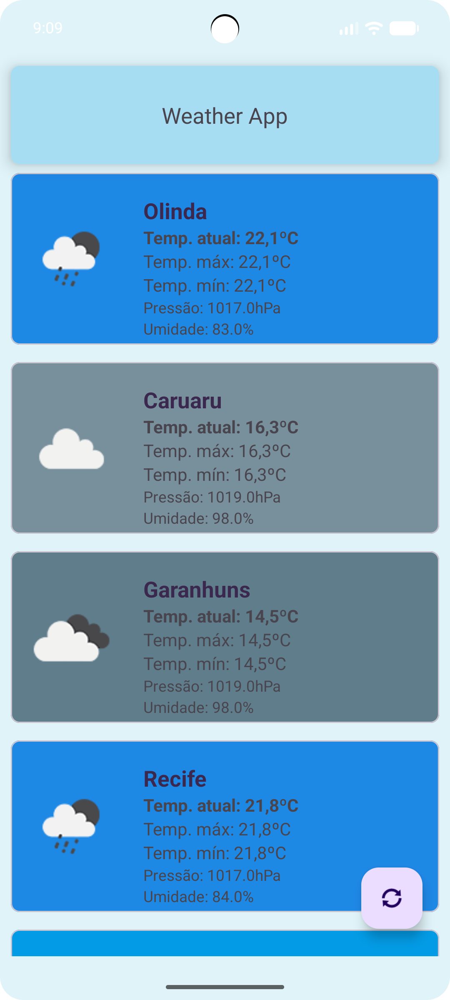
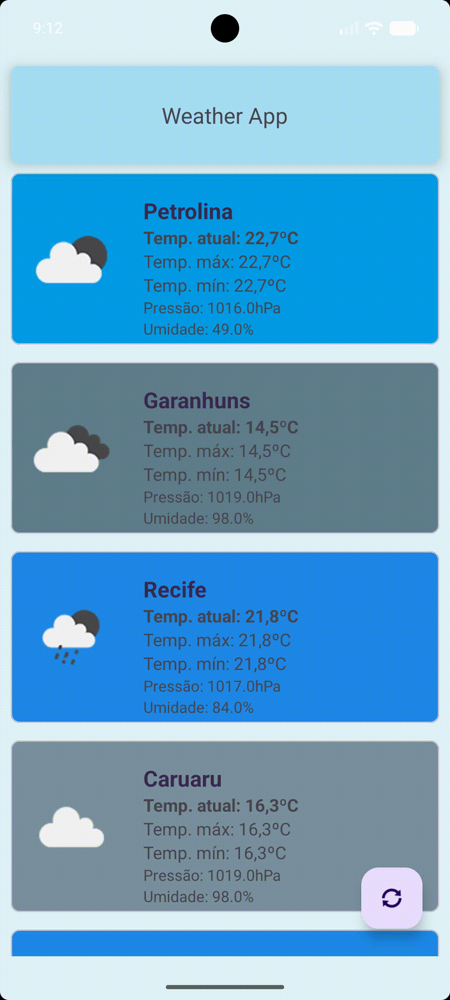

# 🌦️ Weather App Challenge - Solution

This repository contains the solution for the Weather App technical challenge. The application has been refactored and fixed to display real-time weather information for various cities using the [OpenWeather API](https://openweathermap.org/api).

  
  

---

## 🚀 Implemented Features

All tasks proposed in the original roadmap have been completed, along with structural improvements to ensure stability and a better user experience (UX):

- [x] **API Configuration**: Secure API key handling via `local.properties`.
- [x] **Pressure Data**: Dynamic display of real-time pressure data.
- [x] **Refresh Button**: Manual update trigger with visual feedback.
- [x] **Icon Correction**: Fixed assets and comprehensive weather state mapping.
- [x] **Duplicate Elimination**: Unique location repository and logic-level deduplication.
- [x] **Startup Robustness**: Resilient loading that handles partial network failures.
- [x] **Race Condition Protection**: Session-based control for concurrent network calls.
- [x] **Unit Testing**: Implemented a comprehensive test suite for the core ViewModel logic.

---

## 🧠 Technical Decisions & Problem Solving

### 1. Session-Based Asynchronous Control
To prevent **Race Conditions**, a "Session ID" logic was implemented. 
- **The Problem**: If a user clicks "Refresh" multiple times or if a manual refresh overlaps with an automatic one, multiple network calls run in parallel. A slower, older request could finish after a newer one, overwriting the UI with stale data.
- **The Solution**: Each fetch cycle is assigned a unique ID. Callbacks only update the UI if their ID matches the `currentSessionId`. This ensures the UI always reflects the most recent request, without the overhead of manually cancelling complex Retrofit call chains.

### 2. Resilient Synchronization & Partial Updates
- **The Problem**: The original code used an "all-or-nothing" approach—if one city failed to load, the entire screen remained empty.
- **The Solution**: Implemented a **completion counter** that tracks how many requests have finished (success or failure). The UI is updated as soon as all attempts are finalized. This provides a much better UX, as the user can see available data even if one specific city is experiencing temporary API issues.

### 3. Data Integrity via `LinkedHashMap`
- **The Problem**: Potential for duplicate entries if coordinates are redundant or if the API returns inconsistent results.
- **The Solution**: Results are collected in a `LinkedHashMap` using the city name as the key.
    - **Deduplication**: Automatically overwrites any duplicate city entries.
    - **Order Preservation**: Unlike a standard `HashMap`, it maintains the insertion order, ensuring a consistent list sequence for the user.

### 4. Cognitive Load Reduction through Dynamic Theming
- **The Solution**: Implemented a dynamic coloring system where the card background reflects the weather condition and the day/night cycle.
- **The Why**: This allows users to perceive the general weather state (clear, rainy, stormy) and time of day instantly through color recognition, even before reading the numerical data or looking at the icon.

---

## 🧪 Testing

A unit testing suite was implemented to validate the core business logic and ensure the reliability of the synchronization and concurrency mechanisms.

### What is tested:
- **Partial Success Logic**: Validates that the app correctly displays available data even when some network requests fail.
- **Data Deduplication**: Ensures that the `LinkedHashMap` logic correctly handles and eliminates duplicate city data.
- **Race Condition Protection**: A complex test scenario that simulates multiple rapid fetch requests and verifies that only the latest session successfully updates the UI, while stale sessions are correctly ignored.

---

## ⚙️ Configuration and Execution

### Prerequisites:
1. Obtain an API Key at [OpenWeatherMap](https://home.openweathermap.org/api_keys).
2. In the project's root directory, locate or create the `local.properties` file.
3. Add your key: `WEATHER_API_KEY=your_api_key_here`

### Running the App: 
> Android Studio version
1. Open the project in **Android Studio**.
2. Sync Gradle (`File > Sync Project with Gradle Files`).
3. Select an emulator or physical device and click **Run** (`Shift + F10`).

---

## ⚠️ Limitations and Next Steps

1. **Local Persistence**: Implementing **Room** would allow the application to cache weather data and provide a better offline-first experience.
2. **Dependency Injection**: Introducing **Hilt** would improve dependency management and further decouple the application components, making the code easier to maintain and test.
3. **Expanded Test Suite**: Adding **UI tests (Espresso)** and increasing the coverage of unit tests to include edge cases in the Repository and Network layers.
4. **Improved Error Handling**: Providing more granular error states and retry actions for individual cities would improve the user experience when only part of the network requests fail.
5. **Repository Abstraction**: Introducing a dedicated repository layer with interfaces would further separate data access from presentation logic, making it easier to introduce caching or alternative data sources.
